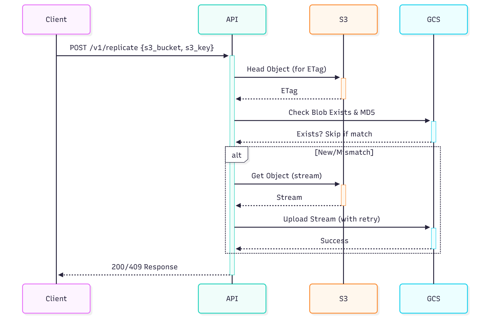

# Cross-Cloud Event-Driven Storage Replicator

Event-driven Python service to replicate objects from AWS S3 to Google Cloud Storage (GCS), optimized for high availability of AryaXAI's multi-cloud AI datasets (e.g., ML embeddings, training files).

## Approach
- **Endpoint**: FastAPI POST `/v1/replicate` with `{"s3_bucket": "...", "s3_key": "..."}`.
- **Replication**: Streams S3 objects into a spooled temp file (memory-efficient, rolls to disk for large files) while computing MD5, then uploads to GCS.
- **Idempotency**: Compares S3 ETag (hex MD5) to GCS base64 MD5. For multipart S3 uploads (ETag with `-N`), falls back to existence check (limitation: no strict hash compare; future recompute planned).
- **Robustness**: Tenacity retries transient errors (e.g., 500s). Validates checksum post-upload; deletes corrupt GCS files on mismatch.
- **Config**: Env vars only (no hardcodes). Logs with correlation IDs for traceability.
- **Why?** Streaming + spool suits AI-scale data. Idempotency prevents duplicates in event storms. Supports AryaXAI's cross-cloud ML workflows.

## Sequence Diagram


## Setup & Run
1. Clone: `git clone your-repo-url`
2. Install: `pip install -r requirements.txt`
3. Copy `.env.example` to `.env`, fill with AWS/GCP creds (keys, JSON path, target bucket).
4. Run: `uvicorn app.main:app --host 0.0.0.0 --port 8000 --reload`

**Docker Run**: `docker build -t replicator .; docker run -p 8000:8000 --env-file .env replicator`

**API Example**:
```bash
curl -X POST http://localhost:8000/v1/replicate \
  -H "Content-Type: application/json" \
  -d '{"s3_bucket": "bhaveshbucket-44", "s3_key": "Test.txt"}'
